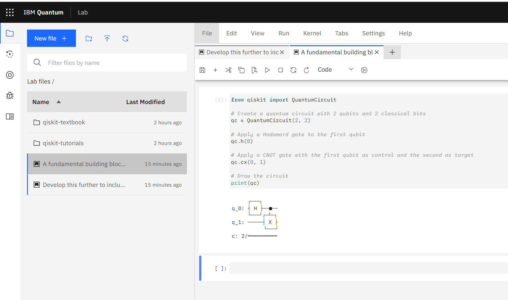
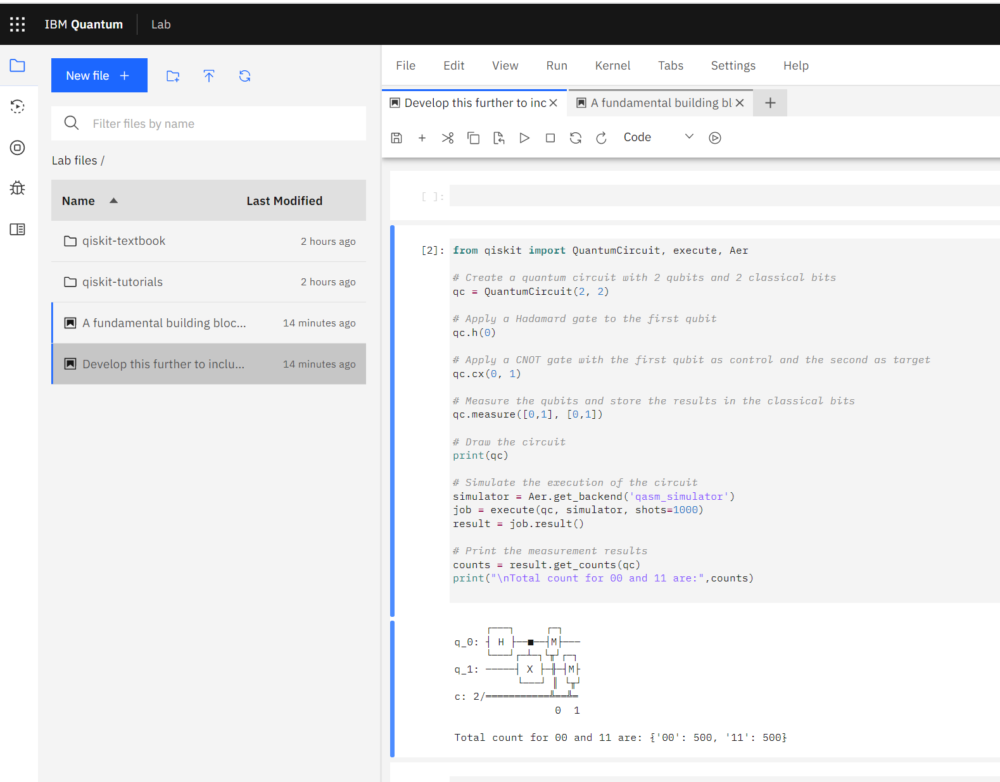

# Ottawa Police Department, Quantum Secure Communication System (Q-SECOP)

To implement a secure communication system using quantum cryptography principles to ensure the confidentiality and integrity of sensitive information shared within the Ottawa Police Department.

## Characters/Roles:

- Chief Officer Clarke - Provides project oversight and ensures the successful implementation of the Q-SECOP. Clarke is also responsible for ensuring that all members of the Ottawa Police Department are adequately trained in the use of the system.

- Sergeant Alice - As part of the IT team, Alice is tasked with setting up and maintaining the quantum communication system. She prepares and sends quantum-encrypted messages.

- Officer Bob - Also a part of the IT team, Bob receives and decodes the quantum-encrypted messages sent by Alice. He works with Alice to detect any potential eavesdropping.

- Detective Eve - Represents potential external threats to the system. The Q-SECOP must be robust enough to detect any intrusion attempts by entities like Eve.

## Project Description:

The project involves setting up a quantum communication system using quantum key distribution (QKD), specifically the BB84 protocol. This system will allow the Ottawa Police Department to exchange information securely, ensuring that sensitive data cannot be intercepted or tampered with.

## Tasks:

`System Setup` : Acquire necessary quantum computing hardware and software. Use Qiskit, an open-source quantum computing framework, to build the quantum circuits needed for the BB84 protocol.

`Training`: Conduct training sessions for the IT team (including Alice and Bob) and other members of the police department. Training will focus on how to use the Q-SECOP for secure communication, and the importance of maintaining the integrity of the quantum keys.

`Testing`: Regularly test the system for any potential security issues. Alice and Bob will simulate the sending and receiving of messages, checking for matching keys to ensure no eavesdropping (by entities like Eve) has occurred.

`Maintenance & Updating`: Regularly maintain and update the system to ensure it is equipped with the latest security measures. This task is primarily undertaken by the IT team.

## Outcome:

Successful implementation of the Q-SECOP will provide the Ottawa Police Department with a state-of-the-art secure communication system, enhancing the confidentiality and integrity of their information exchanges, and helping maintain public trust and safety.

## Setting up and maintaining a quantum communication system
Setting up and maintaining a quantum communication system is a multi-faceted task that involves both hardware and software aspects. As the person responsible for this task, Sergeant Alice would need to perform several key activities:

+ Acquire Quantum Hardware: The first step would be to procure the necessary quantum hardware. This could involve purchasing or leasing a quantum computer from a manufacturer such as IBM, Rigetti, or D-Wave. Alice would need to coordinate with these vendors to ensure the hardware is properly installed and configured.

+ Install Quantum Software: Once the hardware is set up, Alice would need to install the necessary quantum software. This would include a quantum computing framework such as Qiskit, which provides the tools needed to create and run quantum circuits.

+ Develop Quantum Circuits: Using Qiskit, Alice would develop the quantum circuits necessary for implementing the BB84 protocol. This would involve creating a quantum circuit for each bit of information, with each circuit prepared in a specific state depending on the bit value and the chosen basis.

+ Test the System: After setting up the quantum circuits, Alice would need to test the system to ensure it's working correctly. This could involve running the BB84 protocol with known bits and bases, and checking that the correct key is generated.

+ Train Users: Alice would also need to train other members of the Ottawa Police Department on how to use the quantum communication system. This could involve explaining the basics of quantum computing, demonstrating how to send and receive messages, and emphasizing the importance of secure practices.

+ Monitor for Eavesdropping: As part of the ongoing maintenance of the system, Alice would need to regularly check for signs of eavesdropping. This would involve running the BB84 protocol, comparing the keys generated by the sender and receiver, and checking for any discrepancies that could indicate interference.

+ Perform Regular Updates and Maintenance: Finally, Alice would need to perform regular updates and maintenance on the quantum communication system. This could involve updating the quantum software, calibrating the quantum hardware, and troubleshooting any issues that arise.

These tasks would require a broad set of skills in areas such as quantum mechanics, computer science, and information security. Alice would likely need to undergo significant training, and might also need to work closely with external experts, particularly in the early stages of the project.


## Quantum Circuit in Qiskit
Let's look at how to create a simple quantum circuit in Qiskit. The following is a basic example of a quantum circuit that creates a Bell state (an entangled state of two qubits). This is a fundamental building block of many quantum algorithms.

```
from qiskit import QuantumCircuit

# Create a quantum circuit with 2 qubits and 2 classical bits
qc = QuantumCircuit(2, 2)

# Apply a Hadamard gate to the first qubit
qc.h(0)

# Apply a CNOT gate with the first qubit as control and the second as target
qc.cx(0, 1)

# Draw the circuit
print(qc)

```


This quantum circuit first applies a Hadamard gate to the first qubit, putting it into a superposition of states. It then applies a CNOT gate to both qubits, which entangles them. When measured, the qubits will always give the same result (both 0 or both 1), even though each individual result is random.

Now, let's develop this further to include the measurements and simulate the execution of this circuit:


```
from qiskit import QuantumCircuit, execute, Aer

# Create a quantum circuit with 2 qubits and 2 classical bits
qc = QuantumCircuit(2, 2)

# Apply a Hadamard gate to the first qubit
qc.h(0)

# Apply a CNOT gate with the first qubit as control and the second as target
qc.cx(0, 1)

# Measure the qubits and store the results in the classical bits
qc.measure([0,1], [0,1])

# Draw the circuit
print(qc)

# Simulate the execution of the circuit
simulator = Aer.get_backend('qasm_simulator')
job = execute(qc, simulator, shots=1000)
result = job.result()

# Print the measurement results
counts = result.get_counts(qc)
print("\nTotal count for 00 and 11 are:",counts)
```

This script measures the state of the two qubits and stores the results in two classical bits. It then simulates the execution of the quantum circuit with Qiskit's built-in simulator. The "shots" parameter specifies the number of times the circuit is run. The results are then printed out, showing the number of times each possible state (00 and 11) was measured.
